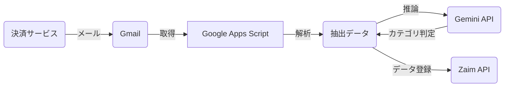

# 基本設計書 (Basic Design)

## 1. 概要

本ドキュメントは、「Zaim Email Importer 要件定義書」に基づき、Google Apps Script (GAS) を用いたシステムの実現方式を定義する基本設計書です。

## 2. システム構成

### 2.1. システム構成図

### 2.2. 利用技術・サービス

| 分類 | 技術・サービス名 | 目的 |
| :--- | :--- | :--- |
| **プラットフォーム** | Google Apps Script | 実行環境 |
| **言語** | JavaScript (ES6) | 開発言語 |
| **メール** | GmailApp | メール取得・操作 |
| **AI** | Gemini API | カテゴリ自動判定 |
| **HTTP通信** | UrlFetchApp | APIリクエスト |

## 3. 機能設計

### 3.1. メール取得・解析機能

* **処理概要:** Gmailから指定期間内の決済通知メールを取得し、解析してデータを抽出する（既読・未読問わず）。
* **トリガー:** 時間主導型トリガー：1日おき
* **入力:**
  * 検索クエリ（スクリプトプロパティまたはコード内定数）
  * 対象期間（開始日・終了日）
* **処理シーケンス:**
    1. `GmailApp.search('from:no-reply@pay.rakuten.co.jp after:YYYY/MM/DD before:YYYY/MM/DD')` でスレッドを取得。
    2. 各スレッドのメッセージを取得し、本文を解析する。
    3. 正規表現を用いて、日付・金額・店舗名を抽出する。
    4. **AI判定:** 抽出した店舗名をAI APIに投げ、Zaimのカテゴリリストから最も適切なものを選択させる。
    5. 処理完了後、`message.markRead()` で既読にする。

### 3.2. Zaim連携機能

* **処理概要:** 抽出したデータをZaim APIに送信する。
* **入力:**
  * Zaim認証情報（スクリプトプロパティ: `ZAIM_CONSUMER_KEY`, `ZAIM_CONSUMER_SECRET`, `ZAIM_ACCESS_TOKEN`, `ZAIM_ACCESS_TOKEN_SECRET`）
* **処理シーケンス:**
    1. OAuth 1.0a の署名を生成する（GAS上で計算）。
    2. `UrlFetchApp.fetch()` を使用して Zaim API (`https://api.zaim.net/v2/home/money/payment`) に POST リクエストを送る。

## 4. ファイル構成 (想定)

GASエディタ上、または `clasp` で管理するファイル構成。

* `Code.js`: メインロジック（トリガーのエントリーポイント）
* `Config.js`: 設定値管理
* `ZaimClient.js`: Zaim API連携クラス
* `Parsers.js`: メール解析ロジック（楽天Payなど）
* `OAuth.js`: OAuth 1.0a 署名生成ロジック

## 5. セキュリティ・運用

1. **認証情報:** コードに直接書かず、GASエディタの「プロジェクトの設定」>「スクリプトプロパティ」に保存する。
