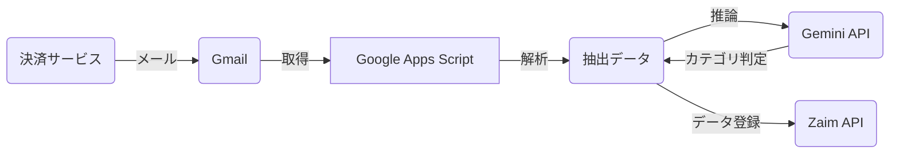
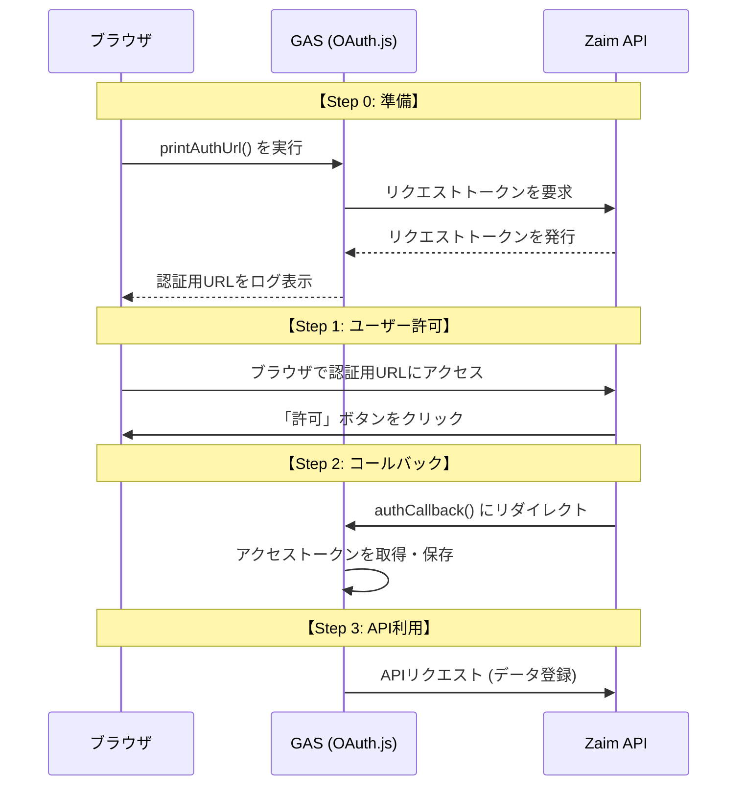

# 基本設計書 (Basic Design)

## 1. 概要

本ドキュメントは、「Zaim Email Importer 要件定義書」に基づき、Google Apps Script (GAS) を用いたシステムの実現方式を定義する基本設計書です。

## 2. システム構成

### 2.1. システム構成図

### 2.2. 利用技術・サービス

| 分類 | 技術・サービス名 | 目的 |
| :--- | :--- | :--- |
| **プラットフォーム** | Google Apps Script | 実行環境 |
| **言語** | JavaScript (ES6) | 開発言語 |
| **メール** | GmailApp | メール取得・操作 |
| **AI** | Gemini API (gemini-2.0-flash) | カテゴリ自動判定 |
| **HTTP通信** | UrlFetchApp | APIリクエスト |
| **認証** | OAuth1 ライブラリ | Zaim API認証 (OAuth 1.0a) |

## 3. 機能設計

### 3.1. メール取得・解析機能

* **処理概要:** Gmailから指定期間内の決済通知メールを取得し、解析してデータを抽出する。
* **トリガー:** 時間主導型トリガー（例: 1日1回）
* **入力:**
  * 検索対象期間: `SEARCH_TARGET_DAYS_AGO` (プロパティ) で指定された日数前〜現在
  * 検索条件: `Config.js` の `PAYMENT_MAILTITLE_MAP` に定義
* **処理シーケンス:**
    1. `main()` 関数が起動。
    2. `searchMails()` で各サービスのメールを検索 (`GmailApp.search`)。
    3. 各メール本文を `Parsers.js` の対応するパーサー関数に渡す。
    4. 正規表現を用いて、日付・金額・店舗名を抽出する。
       * **楽天Pay**: アプリ決済、オンライン決済に対応。HTMLメールはタグ除去処理を行う。
       * **楽天カード**: 「利用のお知らせ」メールから、明細行（利用日、利用先、金額）を抽出。
    5. **カテゴリ判定 (`CategoryHandler.js`):**
       * まず `SHOP_CATEGORY_MAP` (固定リスト) を確認。
       * ヒットしなければ **Gemini API** に店舗名を送信し、適切なカテゴリIDを推論させる。

### 3.2. Zaim連携機能

* **処理概要:** 抽出したデータをZaim APIに送信する。
* **入力:**
  * Zaim認証情報（スクリプトプロパティ）
* **処理シーケンス:**
    1. `ZaimClient` クラスをインスタンス化。
    2. `registerPayment()` メソッドで API (`POST /home/money/payment`) をコール。
    3. コメント欄に `Created by GAS (楽天ペイ)` 等の署名を付与して登録。

### 3.3. 認証フロー

Zaim APIとの連携には OAuth 1.0a を使用します。`OAuth1` ライブラリを利用して実装しています。

## 4. ファイル構成

| ファイル名 | 役割 | 主要な関数/クラス |
| :--- | :--- | :--- |
| `Code.js` | エントリーポイント | `main()`, `searchMails()`, `deleteGasPayments()` |
| `Config.js` | 設定管理 | `PAYMENT_MAILTITLE_MAP`, `SHOP_CATEGORY_MAP`, `CATEGORY_MAP` |
| `Parsers.js` | メール解析 | `rakutenPay()`, `rakutenPayOnline()`, `rakutenCard()` |
| `CategoryHandler.js` | カテゴリ判定 | `getCategory()`, `callGeminiApi()` |
| `ZaimClient.js` | Zaim API連携 | `ZaimClient` class, `registerPayment()`, `getMoney()` |
| `OAuth.js` | 認証処理 | `getService()`, `authCallback()`, `printAuthUrl()` |

## 5. セキュリティ・運用

1. **認証情報:**
   * 全てGASの「スクリプトプロパティ」に保存し、コード内には記述しない。
   * `ZAIM_CONSUMER_KEY`, `ZAIM_CONSUMER_SECRET`, `GEMINI_API_KEY` 等。

2. **データクリーンアップ:**
   * `deleteGasPayments()` 関数により、GASが登録したデータ（コメントで識別）を一括削除可能。開発中のテストや誤登録時のリカバリに使用する。
